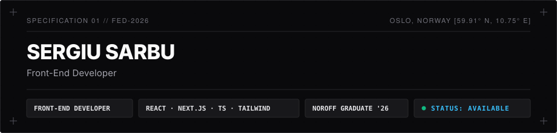

  

&nbsp;&nbsp;

&nbsp;&nbsp;

 

---

### `01` // PROFILE & FOCUS

> **Front-End Development graduate from Noroff, Oslo (2026).**  
> I build responsive, user-centred web applications with clean code, deliberate UI, and things that actually ship. I'd rather deliver information through a concept than a template.

`[✓]` Building modern web applications with **React**, **TypeScript**, and **Next.js**.  
`[✓]` UI motion choreography and micro-interactions with **GSAP**.  
`[✓]` Building and integrating with **AI-assisted workflows & tooling**.

---

### `02` // TECHNICAL STACK

| Domain | Technologies |
| :--- | :--- |
| **Core Front-End** | `JavaScript (ES6+)` `TypeScript` `React` `Next.js` `HTML5` `CSS3` |
| **Styling & Motion** | `Tailwind CSS` `GSAP` `CSS Modules` `Responsive Design` |
| **Tooling & AI** | `Vite` `Git` `GitHub` `Figma` `Netlify` `AI Integration & Workflows` |

---

### `03` // SELECTED WORKS

**Personal Portfolio**  `Next.js` `Tailwind` `GSAP`  

Minimalist portfolio of interactive web experiments, motion design, and deliberate UI.  [Live demo ↗](https://portfolio-sergiu-sa.netlify.app/)

More responsive applications, component experiments and coursework across my [public repositories ↗](https://github.com/sergiu-sa).

---

`END OF SPECIFICATION`

Open to freelance projects, collaborations & entry-level opportunities.

