<!--
  GitHub profile README for github.com/sergiu-sa
  Keep this file and fed-header.svg at the ROOT of the profile repo (sergiu-sa/sergiu-sa).
  Concept: a declassified case file. Palette — oxblood #c4152b · ink #1a1712 · manila #ece6d8.
-->

<div align="center">



<br><br>

<a href="https://portfolio-sergiu-sa.netlify.app/">
  
</a>
&nbsp;&nbsp;
<a href="mailto:sergiudsarbu@gmail.com">
  
</a>

</div>

<br>

<!-- ─────────────────────────────  01  ───────────────────────────── -->


> **Final-year Front-End Development student at Noroff, Oslo — graduating 2026.**
> I build responsive, user-centred web applications and care about clean code, deliberate UI, and shipping things that actually work. I'd rather deliver information through a **concept** than a template.

```text
SUBJECT      Sergiu Sarbu
DISCIPLINE   Front-End Development · React · Next.js · TypeScript
CURRENTLY    new stacks · motion with GSAP · AI-assisted workflows
ASK ME       front-end architecture · responsive design · CSS systems
STATUS       ACTIVE — open to freelance, collaborations & entry-level roles
```

<br>

<!-- ─────────────────────────────  02  ───────────────────────────── -->


<p>
  
  
  
  
  
  
  
  
  
  
  
  
</p>

<br>

<!-- ─────────────────────────────  03  ───────────────────────────── -->


<div align="center">


<br><br>


</div>

<br>

<!-- ─────────────────────────────  04  ───────────────────────────── -->


<p>
  <a href="https://portfolio-sergiu-sa.netlify.app/"></a>
  <a href="https://www.linkedin.com/in/sergiu-sarbu-39154226a/"></a>
  <a href="mailto:sergiudsarbu@gmail.com"></a>
</p>

<br>

<div align="center">


**IN CODE WE TRUST — EVERYTHING ELSE WE INSPECT**

<sub>Open to freelance projects, collaborations & entry-level opportunities.</sub>

</div>
